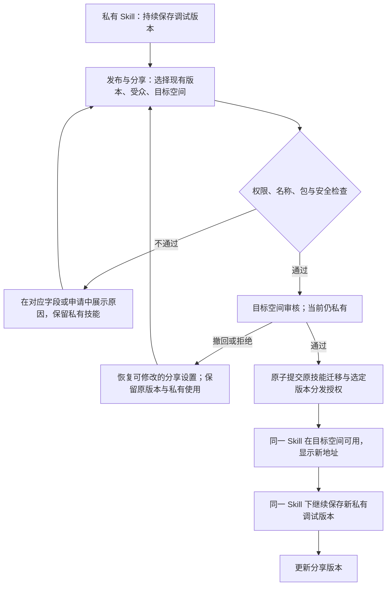

# 私有 Skill 的发布与分享体验设计

状态：已实现并完成本地与容器环境验收。日期：2026-09-15。

## 1. 目标与核心决策

用户先保存私有 Skill、持续调试，准备好后直接分享现有版本。整个过程保留同一个 Skill ID、所有者和版本历史，不要求重新上传，不创建第二个 Skill。

新增技能级入口 **「发布与分享」**。用户选择「分享哪个版本、放在哪个空间、谁可以使用」，系统完成安全检查、目标空间审核与原技能迁移。审核成功前，原技能继续处于私有空间。

示例：`@private/weekly-report` 中的 v0.2.0、v0.3.0、v1.0.0 都属于同一技能。将 v1.0.0 分享到 `@data-team/weekly-report` 后，仍只有一条技能记录；接收者可使用 v1.0.0，作者继续保留私有的调试历史。

完成标准：作者无需下载再上传，不必增加版本号或清理副本，分享失败后仍能使用原技能。

## 2. 优化前的能力与缺口（实现前基线）

| 现状 | 对体验的影响 | 代码位置 |
| --- | --- | --- |
| PRIVATE 上传强制路由到 `@private`，按空间、slug、作者查找或创建 Skill | 改为其他空间重新上传时可能创建另一条 Skill | `SkillPublishService.publishFromEntriesInternal` |
| 详情页只有 PRIVATE + UPLOADED 的版本显示「提交审核」和「确认发布」 | 入口埋在版本操作中；已私有发布的 PUBLISHED 版本无法从此入口分享 | `web/src/pages/skill-detail.tsx` |
| 提交审核服务接收目标可见度，但不接收目标空间，ReviewTask 使用当前空间 | 无法表达私有技能迁移到团队或全局空间 | `SkillReviewSubmitService.submitForReview` |
| 详情页调用提交审核时固定传入 `targetVisibility: 'PUBLIC'` | 用户没有主动选择分享受众的机会 | `web/src/pages/skill-detail.tsx` 的 `handleSubmitForReview` |
| 审核发布修改技能可见度、版本状态及最新版本指针 | 只增加可见度选择，仍无法完成跨空间迁移 | `SkillPublicationService.publishVersion` |
| 提升到全局会新建 Skill、SkillVersion 并复制文件记录 | 其复制语义不满足本场景的单技能要求 | `PromotionService.approvePromotion` |
| 私有「确认发布」也能产生 PUBLISHED 版本 | 分享时不能把所有 PUBLISHED 历史版本都视为已经获准对外分发 | `SkillReviewSubmitService.confirmPublish` |

优化前的代码还允许 PRIVATE 上传把 `latestVersionId` 指向 UPLOADED，和「最新已发布版本指针」的理想约定存在差异。实现前应统一读模型，不能直接沿用该指针来决定分享内容。本工作区未找到 AGENTS.md 引用的 `docs/14-skill-lifecycle.md`，本方案依据已提供的规则、生命周期技能和实际源码，明确区分现状与新增设计。

## 3. 用户入口与文案

### 我的技能

- 私有技能卡片、列表操作区提供文字按钮 **「发布与分享」**；不要求打开版本列表寻找入口。
- 详情页标题附近提供同一入口；版本行上的分享入口仅用于预选该版本。
- 私有技能显示「仅自己可见」；Private 空间显示为 **「我的私有技能」**，辅助文字保留 `@private`。
- 上传保存按钮按意图命名：私有时「保存到私有」，对外提交时「提交审核」。避免把私有保存称为公开发布。
- 当前「确认发布」若仍承担私有版本启用动作，改为「设为个人使用版本」，并说明仅自己可用。
- 已有共享版本后，入口变为 **「管理分享」**；更新动作叫 **「更新分享版本」**。

作者视角把「访问范围」与「流程状态」分开呈现。例如「仅自己可见 · 分享待审核」；不能审核一提交就显示「已公开」。

### 分享设置

桌面使用一个适中宽度的对话框；窄屏使用相同字段的全宽页面。仅在选择公开访问时增加明确的公开确认项。

字段顺序：

1. **分享版本**：默认最新可提交版本，允许选择已有版本；显示版本号、更新时间和检查情况。点击版本可预览此次分享的 README 与文件。
2. **谁可以使用**：用户主动选择团队成员、平台登录用户或公开访问；不默认扩大到公开访问。
3. **目标空间**：团队范围时选择有发布权限的团队；全平台范围时明确显示「全局空间 @global」。无可用团队时给出加入团队或改选平台范围的路径。
4. **发布后的地址**：展示原地址 → 目标地址。保持技能 slug，默认不要求用户理解迁移机制。
5. **确认摘要**：目标受众、选中的版本、审批方、地址变化和历史版本范围；必要检查告警按现有发布确认规则展示。

范围映射沿用已有权限语义，并由服务端返回本实例实际允许的选项：

| 用户选项 | 目标空间 | 分享后技能可见度 | 接收者 |
| --- | --- | --- | --- |
| 团队成员 | 可发布的团队空间 | NAMESPACE_ONLY | 该团队成员 |
| 平台登录用户 | global | NAMESPACE_ONLY | 已登录且满足平台访问策略的用户 |
| 公开访问 | global | PUBLIC | 按实例访问策略允许的访客，可能包含未登录用户 |

「公开访问」文案：**「允许未登录用户访问和下载（仍受本实例访问策略限制）。」** 不承诺自动发布到互联网。必须先主动选择公开范围，再勾选「我确认此版本可以公开访问」。

分享至团队时在目标空间旁说明：**「已分享内容将纳入该团队的管理权限。」** 作者身份保留；原私有历史仍按私有版本规则管理。

普通路径主按钮：**「提交分享申请」**。提交中显示「正在提交…」，防止重复点击。成功后进入申请状态，而非继续留在无反馈的弹窗。若实际策略允许免人工审核，界面根据服务端预检查结果改为「确认分享」，仍保留相应检查与结果反馈。

## 4. 完整流程与失败恢复

| 场景 | 用户看到什么 | 可执行动作与数据规则 |
| --- | --- | --- |
| 提交前取消 | 回到原技能 | 不改变地址、可见度和版本 |
| 安全检查中 | 「分享检查中 · 当前仅自己可见」 | 查看检查状态、取消申请；不展示可分享给他人的成功链接 |
| 待审核 | 「已提交至数据分析团队 · 当前仍为私有」及版本和范围 | 查看进度、撤回申请；普通目标成员不可提前读取 |
| 审核拒绝 | 具体原因及「修改后重新申请」 | 保留私有版本与原地址；新申请可选同一未变包或新版本，重新检查 |
| 用户撤回 | 「已撤回，技能仍为私有」 | 恢复分享设置；不删除源版本 |
| 目标同名 | 「此空间已有 weekly-report，请更换目标空间」 | 查看有权访问的目标技能、切换空间；不覆盖、不自动合并、不暴露不可见技能信息 |
| 审核时发生名称抢占或权限变化 | 「暂未完成分享」与可处理的原因 | 原技能留在私有；保留选择，允许修正后重新提交 |
| 请求超时 | 「正在确认提交结果」 | 按申请 ID／幂等键查询，不要求用户反复上传或创建技能 |
| 成功 | 「已分享至数据分析团队」及可用版本、新地址 | 复制分享链接、查看目标技能；仍出现在「我的技能」且只有一条记录 |

审核人仅获得本次申请选定版本及所需扫描材料的受控访问权；无权因这次申请浏览作者其他私有版本。

当存在有效分享申请时：冻结申请引用的版本内容与目标选择，**允许新增其他私有调试版本**。新增版本不自动替换或撤销正在审核的版本。需要改为分享新版本时，由作者显式执行「撤回并改选版本」。

## 5. 版本规则：一次分享不会公开整个调试历史

这是单 Skill 方案的必要条件，和首次分享一起交付。

- 历史记录全部保留在原 Skill ID 下，作者无需复制技能。
- 只有本次选定、完成检查与授权的版本进入共享分发范围。其他私有历史，包括旧的 PRIVATE + PUBLISHED 版本，继续仅作者及获明确授权的治理主体可见。
- 目标团队管理员可治理已共享技能及共享内容；不得仅凭目标空间管理权限读取迁移前或后续的私有调试版本。若平台另有审计权限，遵循明确的审计授权。
- 分享成功后，作者上传新版本时可选「保存为私有调试版本」或「更新分享版本」；两者均绑定现有 Skill ID，不能因为保存为 PRIVATE 又路由回 `@private` 创建技能。
- 接收者看到「当前分享版本」，作者另外看到「最新调试版本」。调试上传不覆盖对外 README、摘要、文件、安装版本或搜索内容。
- 分享新版本时保留旧共享版本可用，直到新版本成功；失败或撤回不影响旧版本安装。
- 私有使用资格与共享审批分开记录。选择 PRIVATE + PUBLISHED 版本分享时不强制增加版本号、不将其降级为不可私有使用，也不把私有发布视为已通过共享审核。
- 包内容在申请期间不可变；仅改变目标范围时可引用同一包，检查结果的复用必须满足目标策略和有效期。

## 6. 地址、权限与数据连续性

首次分享成功时，示例坐标从 `@private/weekly-report` 变为 `@data-team/weekly-report`。内部 Skill ID、所有者、版本 ID、文件关联、收藏、订阅及审计历史继续关联原记录。无需复制包或重新计算一套技能身份。

新分享链接优先使用可按稳定 Skill ID 解析的详情入口，页面显示当前坐标。旧私有地址兼容应绑定作者身份及 Skill ID；`@private/slug` 可能有多个作者，不能建立跨用户的裸 slug 全局重定向。未授权请求不得通过旧地址发现私有对象；所有别名解析后重新校验目标版本访问权限。

CLI 的新安装命令展示目标坐标。对于已有安装记录，只有已识别来源 Skill ID／作者的兼容解析才能跟随迁移；无法消除歧义时明确提示更新来源地址，不承诺所有旧 CLI 自动重定向。详情与下载的旧地址兼容、更新检测、缓存失效应一起验收。

分享申请由技能所有者发起，目标空间要求发布权限。读取、预检查、提交、审批生效时分别校验权限；不能直接复用「命名空间 ADMIN 可管理生命周期」作为私有历史读取授权。归档、治理隐藏、扫描失败等限制继续生效。提交与生效阶段记录审计事件。

首期默认保留 slug。目标已有同名技能时不静默覆盖或合并；若是同一作者已发布的历史副本，提示进入已有技能处理。副本合并、发布时重命名和任意空间间搬迁是独立后续需求，需要单独处理版本冲突及包内 name 与上传路由的一致性。

## 7. 实现约束与建议分工

以下为实现建议，不表示现有接口已经具备这些行为。

### 持久化与状态边界

- 引入独立的分享申请记录，绑定源 Skill ID、源版本 ID／包摘要、目标空间、目标可见度、申请人、源坐标、校验结果及修订号。它表达跨空间分享意图；不能只用 `requestedVisibility` 表达。
- 分享申请有自己的检查、审核、完成、失败、拒绝与撤回结果。既有 `SkillStatus`、`SkillVersionStatus`、`ReviewTaskStatus` 不增加同名「分享中」枚举；UI 从申请投影状态。
- 审核任务关联分享申请，审批责任属于目标空间。选定私有版本的使用状态不被申请状态破坏。
- 版本增加**实际分发范围**的持久化表达（例如复用可见度枚举的独立字段，或独立分发授权记录）；它与申请中的目标范围不同。版本可读判定至少同时满足容器授权、版本分发授权和生命周期限制。
- 仅修改 `Skill.visibility` 不足以隔离历史私有 PUBLISHED 版本。详情、版本列表、README、文件树、原始文件、ZIP、下载／安装、标签、diff、搜索和兼容 CLI 必须使用一致的授权判断；diff 的两个版本分别校验。
- `latestVersionId` 不再承担私有调试和共享发布两种指针语义。共享 latest 只在成功分发时更新；私有预览／个人使用版本以独立投影或指针解析，不污染共享元数据。
- 历史回填采用保守规则：现存 PRIVATE 技能的所有版本保持私有；其他历史记录根据已生效的发布、可见度与审计证据回填。不把 requestedVisibility 当作已批准证据；无法确定的版本不自动扩权并列出待核验记录。

### 迁移提交

生效前重新验证源版本、目标空间状态、名称冲突、申请人资格、扫描门槛与审核结果。在同一事务内完成目标名称占用、Skill 空间与可见度变更、选中版本分发授权、共享版本指针及申请完成状态；失败则全部回滚，源技能保留原私有状态。

使用共享技能操作锁／乐观锁和数据库名称约束防止重复提交、并发抢名、审批与撤回互相覆盖。同一 Skill 同时至多一个首次分享申请。幂等重试返回已有申请结果。

审计、通知、搜索更新与缓存失效在提交后执行，并可重试。外部索引更新延迟不得导致权限扩大；最终读取仍校验数据库中的有效授权。检查 ZIP／单文件实际 storageKey，禁止因坐标变化盲目重算对象路径。

### 模块与接口能力

| 层 | 负责能力 |
| --- | --- |
| domain | 分享申请、权限与状态规则、原子迁移、版本分发规则、领域事件 |
| infra | 申请与授权记录的持久化、冲突约束实现 |
| app service | 预检查、扫描与审核编排、幂等、撤回和生效工作流 |
| app query repository | 可选目标、版本候选、申请进度、变更摘要、作者／接收者视角投影 |
| controller | 绑定身份与参数、响应包装；提供基于 Skill ID 的预检查、提交、查询与撤回能力 |
| frontend | 在技能详情和我的技能复用分享对话框；TanStack Query 驱动请求，按申请阶段展示状态和恢复入口 |

新接口的具体路径、DTO 和错误码在实现设计中确定；更改接口时运行 `make generate-api`，不手改生成类型。不通过原上传接口伪造重发，也不通过 PromotionService 的复制路径实现迁移。

## 8. 首期范围与验收

首期作为一套完整能力交付：Private → 团队／全局的原技能分享、既有 UPLOADED 与私有 PUBLISHED 版本选择、版本级范围隔离、目标审核与失败恢复、地址连续性，以及分享后在同一 Skill 中继续私有调试并更新共享版本。

后续再评估：公开范围缩小／撤销分享、任意共享空间间迁移、指定个人协作、历史副本合并、复杂重命名。收回已下载的包不是服务端撤销分享能够完成的行为，后续对应文案需要明确边界。

验收场景：

1. 普通作者的私有 UPLOADED 版本可直接发起分享；不上传文件、不新增 Skill、不强制改变版本号。
2. 已私有确认发布的 PUBLISHED 版本同样可选；等待审核期间作者仍能按原私有资格使用。
3. 分享 v1.0.0 后 Skill ID、ownerId、版本总数和历史关联不变；只有 v1.0.0 对目标受众开放。
4. 匿名用户、非目标团队成员及目标团队管理员均不能借新地址、旧地址、版本号、diff 或下载接口读取未授权私有历史。
5. 正确审核人能读取申请选中的版本，不得读取其他私有历史；原私有空间成员不会收到错误的目标审核任务。
6. 审核中新增私有调试版本不撤销／替换分享申请；作者可显式撤回并改选版本。
7. 拒绝、撤回、扫描不通过、目标权限丢失及名称冲突均保留原私有技能与包，显示具体恢复动作。
8. 重复点击、超时重试、并发审批、审批与撤回竞态只产生一次最终生效；数据库失败不出现半迁移。
9. 分享后上传 v1.1.0 私有调试版本仍属于原 Skill，接收者继续安装 v1.0.0；v1.1.0 完成分享后才切换共享 latest。
10. 目标同名不覆盖；不同作者的同名私有地址兼容不串号；旧 CLI 无法确定来源时获得可行动的更新地址提示。
11. 团队成员、平台登录用户和公开访问三种范围按本实例的真实访问策略生效；公开选项要求主动确认。
12. 弹窗支持键盘、焦点恢复、Esc 关闭，错误邻近字段并可被读屏感知；320px 窄屏无横向溢出；提交过程禁重复操作。

上线验收执行有意义的领域事务与权限回归、接口测试、前端类型／lint 和覆盖上述主路径的浏览器测试；按仓库规则运行 `make test-backend-app`、`make typecheck-web`、`make lint-web`、`make staging`。实际实现与验证记录见第 9 节。

效果衡量：首次分享完成率、从打开分享到成功提交的耗时、失败后恢复完成率、因私有转共享而新建副本的次数。目标是此流程新增 Skill 记录数为 0；业务转化指标上线后以真实基线对比。

## 9. 实现与接口

本次实现保留同一个 Skill ID，并增加 `skill_share_request` 和版本级 `distribution_visibility`。源版本在等待扫描及审核时维持原使用状态；只有批准的版本获得分发范围。分享完成后，原 Private 上传地址按作者识别原技能，后续私有上传继续保存到该技能，响应返回实际坐标。

分享窗口在「我的技能」和详情页复用。作者可选择已有版本、目标空间和受众，预检查后提交；公开受众需要明确确认。窗口支持扫描/审核进度恢复、撤回、失败重试、固定链接、键盘焦点约束及窄屏展示。已共享技能的私有续传入口固定 Skill ID，沿用原技能身份。版本列表标明「仅自己可见」。

| 方法 | 路径（同时支持 `/api/web` 和 `/api/v1`） | 行为 |
| --- | --- | --- |
| GET | `/skills/by-id/{skillId}/sharing` | 作者查询候选版本、可发布空间和最近申请 |
| POST | `/skills/by-id/{skillId}/sharing/precheck` | 校验目标、权限、同名冲突及已有包 |
| POST | `/skills/by-id/{skillId}/sharing` | 按幂等键提交，绑定独立扫描记录 |
| POST | `/skills/by-id/{skillId}/sharing/{requestId}/withdraw` | 撤回活动申请，保留原版本 |
| POST | `/skills/by-id/{skillId}/private-versions` | 将 ZIP 保存为同一技能的新私有版本 |
| GET | `/skills/by-id/{skillId}/location` | 授权后解析实际坐标 |

分享请求字段为 `versionId`、`targetNamespaceId`、`targetVisibility`、`idempotencyKey`、`confirmPublic` 和 `confirmWarnings`。普通作者使用目标空间现有审核队列；超级管理员仍需通过扫描。申请状态独立为 `SCANNING`、`PENDING_REVIEW`、`COMPLETED`、`REJECTED`、`WITHDRAWN`、`FAILED`。

迁移 `V51__skill_sharing.sql` 保守回填历史分发权限，修正指向未发布版本的 latest 指针，并添加申请幂等与活动请求约束。目标空间名称锁和原技能操作锁在事务内串行处理；版本与技能的乐观锁防止并发写覆盖。扫描结果按独立 audit ID 关联，过期结果不能推进新申请。

浏览器永久入口为 `/skills/by-id/{skillId}`。原 Private 地址仅按作者解析；无权限者无法通过该别名读取私有历史。服务端详情与安装解析返回当前坐标。

验证结果：

- `make test-backend-app`：1,342 项通过，14 项按现有测试配置跳过，无失败。包含分享事务、权限隔离、名称冲突、撤回、扫描关联及删除乐观锁回归。
- `make typecheck-web`、`make lint-web`：通过。`make generate-api` 从运行中的后端生成，复核结果一致。
- `make test-frontend`：194 个测试文件、714 项用例通过。
- 分享浏览器测试：6 项通过，覆盖首次分享、公开确认、焦点与撤回、冲突恢复、320px 窄屏和后续共享版本更新。
- `make staging`：最终构建通过，15 项基础烟测通过。
- `scripts/sharing-smoke-test.py`：使用真实 PostgreSQL 和扫描器通过完整分享流程；验证普通用户提交、目标审核、Skill ID 不变、私有历史详情/文件/下载/diff 隔离、共享 latest 保持、私有续传和旧上传地址跟随。测试技能已清理。

真实环境验证同时覆盖了新增乐观锁后的删除路径：删除流程使用更新后的受管实体，避免清空 latest 指针后继续以旧版本实体删除而失败。

本机 staging 使用 `quay.io/minio/minio:latest` 替代无法拉取的默认 MinIO 镜像，并通过临时 Compose 覆盖文件将 Web/API 映射到 18000/18080，数据库依赖不发布宿主端口。仓库默认部署配置未修改。
